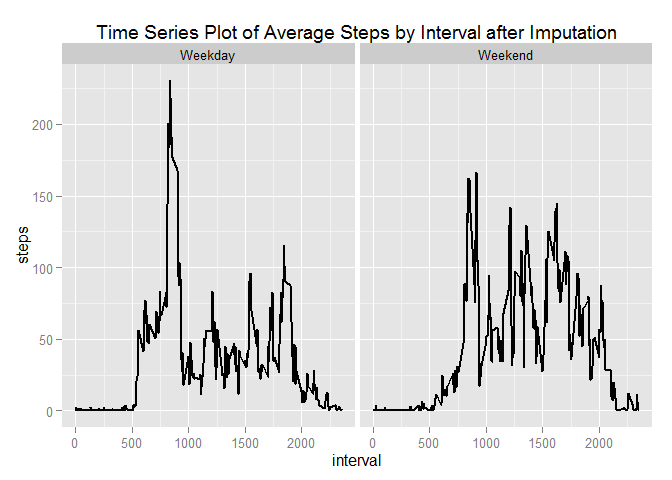

# Reproducible Research: Peer Assessment 1


## Loading and preprocessing the data

Loading the data (using read.csv())


```r
df <- read.csv("activity.csv")
```

Transforming the data into Date data type:


```r
df$date <- as.Date(df$date)
```


## What is mean total number of steps taken per day?

* Create a new dataset ignoring missing data NA
* Plot a histogram of the total number of steps taken each day
* Report the mean and median total number of steps taken per day

Histogram of the total number of steps taken each day


```r
library(ggplot2)
totalsteps_perday <- aggregate(x = df$steps , by = list(df$date), FUN = sum ,na.rm=TRUE)
names(totalsteps_perday) <- c("date","steps")
```

Plot histogram of the total number of steps taken each day: 

```r
histplot <- ggplot(totalsteps_perday,aes(x = steps)) +
            ggtitle("Histogram of daily steps") +
            xlab("Steps (binwidth 2000)") +
            geom_histogram(binwidth = 2000)
histplot
```

 

Mean total number of steps taken per day:

```r
mean(totalsteps_perday$steps , na.rm = TRUE)
```

```
## [1] 9354.23
```

Median total number of steps taken per day:

```r
median(totalsteps_perday$steps , na.rm = TRUE)
```

```
## [1] 10395
```

## What is the average daily activity pattern?

* Calculate average steps for each of 5-minute interval during a 24-hour period.
* Make a time series plot (i.e. type = "l") of the 5-minute interval (x-axis) and the average number of steps taken, averaged across all days (y-axis)
* Report which 5-minute interval, on average across all the days in the dataset, contains the maximum number of steps?
* Observer and comment the average daily activity pattern

Time series plot of 5-minute interval and the average number of steps taken, averaged across all days:

```r
averageSteps_byInterval  <- aggregate(x = df$steps , by = list(df$interval), FUN = mean ,na.rm=TRUE)
names(averageSteps_byInterval) <- c("interval","steps")

avgStepLine <- ggplot( averageSteps_byInterval,aes(interval,steps)) +
                 ggtitle("Time Series Plot of Average Steps by Interval") +
                 geom_line()
avgStepLine  
```

 

The 5-min time interval contains the maximum number of steps?

```r
averageSteps_byInterval[which.max(averageSteps_byInterval$steps),c("interval")]
```

```
## [1] 835
```

##### Observations:
Based on steps taken pattern, the person's daily activity peaks around 8:35am.

## Imputing missing values

Total number of missing values in the dataset

```r
nrow(df[is.na(df$steps),])
```

```
## [1] 2304
```

Imputing missing step values with mean step at time interval

```r
df.imputed <- merge(x = df, y = averageSteps_byInterval, by = "interval", all.x = TRUE)
df.imputed[is.na(df.imputed$steps.x),c("steps.x")] <- df.imputed[is.na(df.imputed$steps.x),c("steps.y")]
```

Cleaning the data

```r
df.imputed$date <- as.Date(df.imputed$date)
df.imputed$date.x <- NULL
df.imputed$Group.1 <- NULL
df.imputed$steps <- df.imputed$steps.x
df.imputed$steps.x <- NULL
df.imputed$steps.y <- NULL
```

Histogram with new dataframe

```r
totalsteps_perday  <- aggregate(x = df.imputed$steps , by = list(df.imputed$date), FUN = sum ,na.rm=TRUE)
names(totalsteps_perday ) <- c("date","steps")
histplot <- ggplot(totalsteps_perday ,aes(x = steps)) +
            ggtitle("Histogram of daily steps after imputation") +
            xlab("Steps (binwidth 2000)") +
            geom_histogram(binwidth = 2000)
histplot 
```

 

Mean total number of steps taken per day

```r
mean(totalsteps_perday $steps , na.rm = TRUE)
```

```
## [1] 10766.19
```

Median total number of steps taken per day

```r
median(totalsteps_perday $steps , na.rm = TRUE)
```

```
## [1] 10766.19
```


## Are there differences in activity patterns between weekdays and weekends?

Factor variable with two levels indicating a weekday or weekend.

```r
df.imputed$weekday <- as.factor(ifelse(weekdays(df.imputed$date) %in% c("Saturday","Sunday"), "Weekend", "Weekday")) 

average.steps.by.interval.and.weekday  <- aggregate(x = df.imputed$steps , 
                                                    by = list(df.imputed$interval,df.imputed$weekday), FUN = mean ,na.rm=TRUE)
names(average.steps.by.interval.and.weekday) <- c("interval","weekday","steps")
```

Panel time series plot of the 5-minute interval and the average number of steps taken 
averaged across all weekday days or weekend days.

```r
avg.step.line <- ggplot(average.steps.by.interval.and.weekday,aes(interval,steps)) +
                 ggtitle("Time Series Plot of Average Steps by Interval after Imputation") +
                 facet_grid(. ~ weekday) +
                 geom_line(size = 1)
avg.step.line 
```

 

